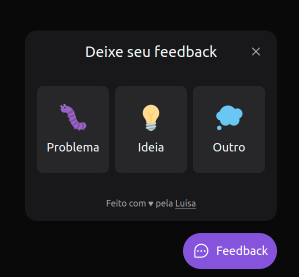
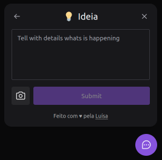

<h1 align="center">
	Feedback Widget
</h1>

  
  

  

  

  

## 🚀 Projeto

Widget component to get users feedback

## 🔧 Tecnologias

- Vite
- TailWindCSS
- ReactJS
- NodeJS
- React native
- Expo
- ESLint + Prettier + EditorConfig;
- VS Code
- TypeScript

## 🚀 **Em constante evolução...**

---

Feito com ♥ by [Luísa Corrêa](https://www.linkedin.com/in/luisafcorrea/)